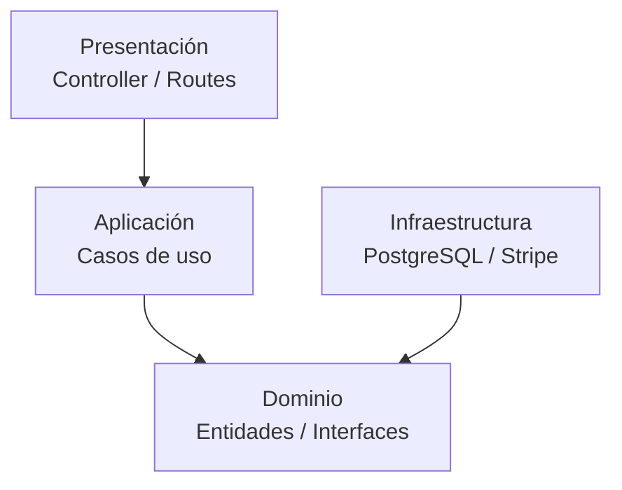
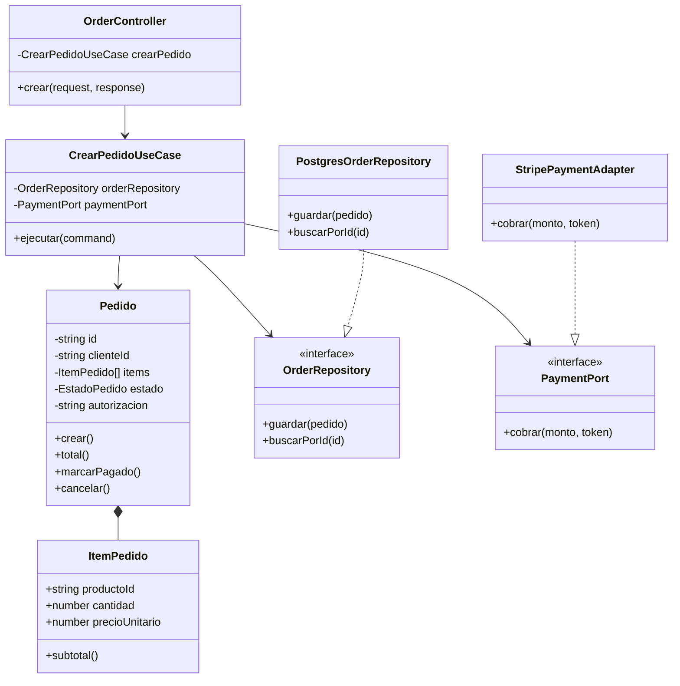
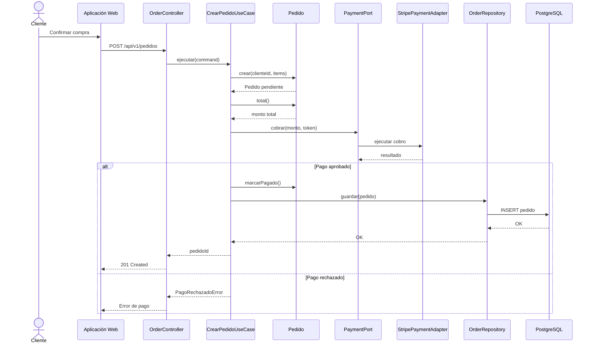

# Diseño interno de módulos

> **Proyecto:** Marketplace de productos para mascotas  
> **Backend:** Node.js + TypeScript  
> **Módulo de referencia:** Pedidos  
> **Enfoque:** Clean Architecture dentro de un monolito modular  
> **Nivel relacionado del modelo C4:** Nivel 4 - Código

---

## 1. Propósito

Este documento describe la organización interna de los módulos que conforman el backend del Marketplace.

Para representar el diseño interno se toma como referencia el **módulo Pedidos**, debido a que participa en uno de los procesos principales del negocio: la compra de productos.

El diseño busca:

- Separar las reglas del negocio de los detalles tecnológicos.
- Mantener responsabilidades claras dentro de cada capa.
- Reducir el acoplamiento entre componentes.
- Facilitar las pruebas y el mantenimiento.
- Permitir sustituir tecnologías externas sin modificar las reglas principales del negocio.
- Establecer una estructura común que pueda aplicarse a otros módulos del Marketplace.

---

# 2. Módulo de referencia: Pedidos

El módulo **Pedidos** es responsable de gestionar el proceso mediante el cual un cliente confirma una compra.

Entre sus principales responsabilidades se encuentran:

- Crear pedidos.
- Validar los productos incluidos.
- Calcular el total del pedido.
- Gestionar el estado del pedido.
- Solicitar el procesamiento del pago.
- Persistir la información del pedido.
- Coordinar posteriormente operaciones relacionadas con envío y notificaciones.

---

# 3. Organización interna mediante Clean Architecture

El módulo se divide en las siguientes capas:

```text
┌───────────────────────────────────────────┐
│              Presentación                 │
│        Controllers / Routes / HTTP        │
│                                           │
│    ┌─────────────────────────────────┐    │
│    │           Aplicación            │    │
│    │      Casos de uso / Commands    │    │
│    │                                 │    │
│    │    ┌───────────────────────┐    │    │
│    │    │       Dominio         │    │    │
│    │    │ Entidades / Reglas    │    │    │
│    │    │ Puertos / Interfaces  │    │    │
│    │    └───────────────────────┘    │    │
│    └─────────────────────────────────┘    │
│                                           │
│              Infraestructura              │
│ PostgreSQL / Stripe / servicios externos  │
└───────────────────────────────────────────┘
```

La regla fundamental es:

> Las dependencias deben dirigirse hacia el dominio.

El dominio no debe depender directamente de Express, PostgreSQL, Stripe, ORM u otros frameworks.

---

# 4. Estructura de carpetas propuesta

```text
src/
└── modules/
    └── pedidos/
        │
        ├── dominio/
        │   ├── pedido.ts
        │   ├── item-pedido.ts
        │   ├── estado-pedido.ts
        │   ├── order-repository.ts
        │   ├── payment-port.ts
        │   └── resultado-cobro.ts
        │
        ├── aplicacion/
        │   ├── crear-pedido.use-case.ts
        │   └── crear-pedido.command.ts
        │
        ├── infraestructura/
        │   ├── postgres-order-repository.ts
        │   ├── stripe-payment.adapter.ts
        │   └── paypal-payment.adapter.ts
        │
        ├── presentacion/
        │   ├── order.controller.ts
        │   └── pedidos.routes.ts
        │
        ├── pedidos.module.ts
        └── index.ts
```

---

# 5. Responsabilidad de los principales archivos

| Archivo | Capa | Responsabilidad |
|---|---|---|
| `pedido.ts` | Dominio | Representar un pedido y aplicar sus principales reglas de negocio. |
| `item-pedido.ts` | Dominio | Representar cada producto contenido en un pedido. |
| `estado-pedido.ts` | Dominio | Definir los estados válidos del pedido. |
| `order-repository.ts` | Dominio | Definir las operaciones necesarias para persistir pedidos. |
| `payment-port.ts` | Dominio | Definir el contrato utilizado para realizar un cobro. |
| `resultado-cobro.ts` | Dominio | Representar el resultado devuelto por un servicio de pago. |
| `crear-pedido.use-case.ts` | Aplicación | Coordinar el proceso para crear un pedido. |
| `crear-pedido.command.ts` | Aplicación | Representar los datos necesarios para ejecutar el caso de uso. |
| `postgres-order-repository.ts` | Infraestructura | Implementar la persistencia de pedidos mediante PostgreSQL. |
| `stripe-payment.adapter.ts` | Infraestructura | Adaptar la comunicación con Stripe al contrato definido por el dominio. |
| `paypal-payment.adapter.ts` | Infraestructura | Alternativa para adaptar la comunicación con PayPal. |
| `order.controller.ts` | Presentación | Recibir solicitudes HTTP y ejecutar los casos de uso. |
| `pedidos.routes.ts` | Presentación | Registrar las rutas HTTP del módulo Pedidos. |
| `pedidos.module.ts` | Composición | Crear las dependencias concretas y conectarlas. |
| `index.ts` | Composición | Exponer la interfaz pública del módulo hacia otros módulos. |

---

# 6. Capas del módulo

## 6.1. Dominio

La capa de dominio contiene las reglas centrales relacionadas con los pedidos.

Contiene:

- Entidades.
- Objetos de valor.
- Enumeraciones.
- Interfaces.
- Reglas de negocio.

Ejemplos:

```text
Pedido
ItemPedido
EstadoPedido
OrderRepository
PaymentPort
```

### Regla

El dominio no conoce tecnologías externas.

Por lo tanto:

```text
Dominio
   ✗ Express
   ✗ PostgreSQL
   ✗ Stripe
   ✗ PayPal
   ✗ Frameworks
```

El dominio únicamente representa conceptos y reglas del negocio.

---

## 6.2. Aplicación

La capa de aplicación contiene los **casos de uso** del sistema.

Su responsabilidad es coordinar las acciones necesarias para completar una operación.

Ejemplo:

```text
CrearPedidoUseCase
```

Este caso de uso puede:

1. Recibir los datos del pedido.
2. Crear los elementos correspondientes.
3. Crear la entidad Pedido.
4. Calcular el total.
5. Solicitar el cobro.
6. Verificar el resultado.
7. Actualizar el estado.
8. Solicitar la persistencia.

La capa de aplicación puede depender del dominio, pero no debe depender directamente de infraestructura.

---

## 6.3. Infraestructura

La capa de infraestructura contiene las implementaciones tecnológicas.

Ejemplos:

```text
PostgresOrderRepository
StripePaymentAdapter
PayPalPaymentAdapter
```

Esta capa permite conectar el dominio con tecnologías externas como:

- PostgreSQL.
- Stripe.
- PayPal.
- APIs externas.

Infraestructura implementa las interfaces definidas por el núcleo de la aplicación.

Ejemplo:

```text
OrderRepository
        ▲
        │ implementa
        │
PostgresOrderRepository
```

También:

```text
PaymentPort
     ▲
     │ implementa
     │
StripePaymentAdapter
```

---

## 6.4. Presentación

La capa de presentación se encarga de recibir las solicitudes de los usuarios.

En este proyecto utiliza:

```text
HTTP
REST
Express
JSON
```

Sus principales elementos son:

```text
OrderController
PedidosRoutes
```

El controlador recibe la solicitud HTTP y la convierte en una llamada al caso de uso correspondiente.

Ejemplo:

```text
POST /api/v1/pedidos
         │
         ▼
OrderController
         │
         ▼
CrearPedidoUseCase
```

El controlador no debe contener las reglas principales del negocio.

---

## 6.5. Composición

La composición es el punto donde se crean y conectan las implementaciones concretas.

Ejemplo:

```text
PostgresOrderRepository
          │
          │
          ▼
CrearPedidoUseCase
          ▲
          │
StripePaymentAdapter
```

La raíz de composición permite aplicar **inyección de dependencias**.

De esta manera, el caso de uso depende de interfaces y no directamente de tecnologías concretas.

---

# 7. Regla de dependencias

La dependencia entre capas se representa de la siguiente forma:



La dirección de las dependencias debe apuntar hacia el dominio.

Esto significa:

```text
Presentación ─────► Aplicación ─────► Dominio

Infraestructura ────────────────────► Dominio
```

No debe suceder:

```text
Dominio ─────► PostgreSQL
Dominio ─────► Express
Dominio ─────► Stripe
Aplicación ──► PostgresOrderRepository
```

---

# 8. Diseño de clases del módulo Pedidos



---

# 9. Flujo para crear un pedido

El proceso principal se ejecuta de la siguiente manera:



---

# 10. Entidad Pedido

La entidad `Pedido` representa el concepto principal del módulo.

Ejemplo conceptual:

```typescript
export class Pedido {

    private constructor(
        readonly id: string,
        readonly clienteId: string,
        private readonly items: ItemPedido[],
        private estado: EstadoPedido,
        private autorizacion?: string
    ) {}

    total(): number {
        return this.items.reduce(
            (suma, item) => suma + item.subtotal(),
            0
        );
    }

    marcarPagado(autorizacion: string): void {

        if (this.estado !== EstadoPedido.PENDIENTE) {
            throw new Error(
                "Solo un pedido pendiente puede marcarse como pagado"
            );
        }

        this.estado = EstadoPedido.PAGADO;
        this.autorizacion = autorizacion;
    }
}
```

La clase contiene comportamiento propio del negocio.

Por lo tanto, operaciones como:

```text
calcular total
cambiar estado
validar transición
cancelar pedido
```

deben pertenecer al dominio y no al controlador o a la base de datos.

---

# 11. Puerto de persistencia

El dominio define qué necesita para guardar pedidos mediante una interfaz.

```typescript
export interface OrderRepository {

    guardar(pedido: Pedido): Promise<void>;

    buscarPorId(
        id: string
    ): Promise<Pedido | null>;

}
```

El dominio conoce:

```text
OrderRepository
```

pero no conoce:

```text
PostgreSQL
```

La implementación concreta se encuentra en infraestructura.

---

# 12. Puerto de pago

El dominio también define el contrato necesario para procesar un pago.

```typescript
export interface PaymentPort {

    cobrar(
        monto: number,
        token: string
    ): Promise<ResultadoCobro>;

}
```

Gracias a esta abstracción:

```text
CrearPedidoUseCase
        │
        ▼
PaymentPort
      ▲   ▲
      │   │
 Stripe   PayPal
```

el caso de uso no depende directamente de Stripe.

---

# 13. Caso de uso CrearPedido

El caso de uso coordina el proceso de creación de un pedido.

```typescript
export class CrearPedidoUseCase {

    constructor(
        private readonly orderRepository: OrderRepository,
        private readonly paymentPort: PaymentPort
    ) {}

    async ejecutar(
        command: CrearPedidoCommand
    ): Promise<string> {

        const pedido = Pedido.crear(
            command.clienteId,
            command.items
        );

        const monto = pedido.total();

        const resultado = await this.paymentPort.cobrar(
            monto,
            command.tokenPago
        );

        if (!resultado.aprobado) {
            throw new Error("Pago rechazado");
        }

        pedido.marcarPagado(
            resultado.autorizacion
        );

        await this.orderRepository.guardar(
            pedido
        );

        return pedido.id;
    }
}
```

La característica más importante es que el caso de uso depende de:

```text
OrderRepository
PaymentPort
```

y no directamente de:

```text
PostgresOrderRepository
StripePaymentAdapter
```

---

# 14. Adaptador de pago

Una implementación de infraestructura puede utilizar Stripe.

```typescript
export class StripePaymentAdapter
    implements PaymentPort {

    async cobrar(
        monto: number,
        token: string
    ): Promise<ResultadoCobro> {

        // Comunicación con el proveedor externo.

        return {
            aprobado: true,
            autorizacion: "AUTH-001"
        };
    }
}
```

El adaptador traduce la API externa al lenguaje definido por el dominio.

---

# 15. Controlador

El controlador recibe las solicitudes HTTP.

```typescript
export class OrderController {

    constructor(
        private readonly crearPedido:
            CrearPedidoUseCase
    ) {}

    crear = async (
        req: Request,
        res: Response
    ): Promise<void> => {

        const pedidoId =
            await this.crearPedido.ejecutar({
                clienteId: req.user.id,
                items: req.body.items,
                tokenPago: req.body.tokenPago
            });

        res.status(201).json({
            pedidoId
        });
    };
}
```

El controlador se limita principalmente a:

```text
HTTP
 ↓
validar / transformar entrada
 ↓
ejecutar caso de uso
 ↓
transformar respuesta
 ↓
HTTP
```

No debe calcular totales, realizar consultas SQL ni contener reglas centrales del negocio.

---

# 16. Raíz de composición

El módulo debe contar con un punto en el que se conecten las implementaciones concretas.

Ejemplo:

```typescript
export function crearModuloPedidos(
    db: Pool,
    stripe: Stripe
) {

    const repository =
        new PostgresOrderRepository(db);

    const payment =
        new StripePaymentAdapter(stripe);

    const crearPedido =
        new CrearPedidoUseCase(
            repository,
            payment
        );

    const controller =
        new OrderController(
            crearPedido
        );

    return {
        controller
    };
}
```

Esta configuración permite sustituir implementaciones.

Por ejemplo:

```text
StripePaymentAdapter
        ↓

PayPalPaymentAdapter
```

sin modificar:

```text
Pedido
CrearPedidoUseCase
PaymentPort
```

---

# 17. API pública del módulo

Cada módulo debe controlar qué funcionalidades expone a los demás módulos.

El archivo:

```text
index.ts
```

representa la API pública del módulo.

Otros módulos deberían importar solamente elementos expuestos por esta interfaz y no acceder directamente a archivos internos.

Ejemplo:

```text
Módulo Envíos
      │
      ▼
API pública de Pedidos
      │
      ▼
Módulo Pedidos
```

Debe evitarse:

```text
Módulo Envíos
      │
      └────► tablas internas de Pedidos
```

---

# 18. Reglas del diseño interno

Para mantener la arquitectura definida se establecen las siguientes reglas:

1. El dominio no depende de frameworks ni tecnologías externas.
2. Los casos de uso dependen de interfaces definidas por el núcleo del sistema.
3. Los controladores no contienen reglas principales del negocio.
4. Las implementaciones de persistencia se encuentran en infraestructura.
5. Las integraciones con servicios externos se implementan mediante adaptadores.
6. Las dependencias concretas se crean en la raíz de composición.
7. Los módulos se comunican mediante interfaces públicas.
8. Un módulo no debe acceder directamente a las tablas internas de otro módulo.
9. Las reglas de negocio deben permanecer independientes de Express, PostgreSQL, Stripe u otras tecnologías.
10. La sustitución de una tecnología externa no debería requerir modificar el dominio.

---

# 19. Relación con Clean Architecture

La estructura propuesta aplica los principios de Clean Architecture mediante la siguiente organización:

| Clean Architecture | Aplicación en el Marketplace |
|---|---|
| Entities | `Pedido`, `ItemPedido`, `EstadoPedido` |
| Use Cases | `CrearPedidoUseCase` |
| Interface Adapters | Controllers, repositorios y adaptadores |
| Frameworks & Drivers | Express, PostgreSQL, Stripe |
| Dependency Rule | Las dependencias apuntan hacia el dominio |

---

# 20. Beneficios del diseño

La organización interna propuesta permite:

- Separar las reglas del negocio de la tecnología.
- Reducir el acoplamiento.
- Facilitar las pruebas unitarias.
- Sustituir proveedores externos.
- Facilitar el mantenimiento.
- Mantener una estructura uniforme entre módulos.
- Controlar las dependencias.
- Facilitar la evolución futura del Marketplace.

---

# 21. Conclusión

El módulo Pedidos se organiza internamente utilizando Clean Architecture.

El dominio concentra las reglas principales del negocio, la capa de aplicación coordina los casos de uso, la infraestructura proporciona implementaciones tecnológicas y la presentación permite interactuar con el sistema mediante HTTP.

Las interfaces `OrderRepository` y `PaymentPort` permiten que las reglas del negocio permanezcan desacopladas de PostgreSQL y de proveedores específicos de pago.

Esta estructura puede utilizarse como referencia para organizar los demás módulos del Marketplace, manteniendo una arquitectura modular, mantenible y preparada para evolucionar.