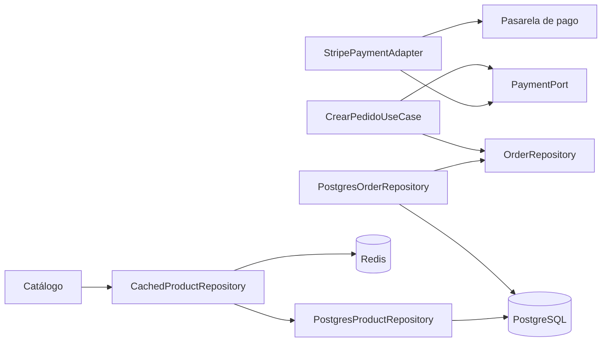

# Patrones de diseño

> **Proyecto:** Marketplace de productos para mascotas  
> **Backend:** Node.js + Express / TypeScript  
> **Estilo arquitectónico:** Monolito modular  
> **Enfoque interno:** Clean Architecture  
> **Base arquitectónica:** Componentes definidos en el modelo C4

---

## 1. Objetivo

Documentar los patrones de diseño aplicados en el backend del Marketplace, indicando:

- Dónde se utilizan.
- Qué problema resuelven.
- Qué componente participa.
- Cómo se implementan.
- Qué beneficio proporcionan a la arquitectura.

El objetivo es mantener una forma uniforme de desarrollar los módulos y evitar que las reglas del negocio dependan directamente de tecnologías externas.

---

# 2. Contexto arquitectónico

El Marketplace utiliza una arquitectura basada en un **monolito modular**, donde cada módulo representa una responsabilidad específica del negocio.

Entre los módulos principales se encuentran:

- Usuarios.
- Sellers.
- Catálogo.
- Carrito.
- Pedidos.
- Pagos.
- Envíos.
- Notificaciones.

Internamente cada módulo sigue los principios de **Clean Architecture**, separando:

```text
Presentación
     ↓
Aplicación
     ↓
Dominio

Infraestructura
     ↓
Dominio
```

Los patrones de diseño permiten implementar estas separaciones manteniendo bajo acoplamiento entre las reglas del negocio y las tecnologías externas.

---

# 3. Patrones aplicados

| Patrón | Dónde se usa | Problema que resuelve | Implementación |
|---|---|---|---|
| Adapter | Pagos → Pasarela de pago | La pasarela externa posee una API diferente al lenguaje utilizado por el dominio. | `PaymentPort` + `StripePaymentAdapter` |
| Adapter | Pedidos → ERP | El ERP externo posee su propio contrato y API. | `ERPPort` + `ERPAdapter` |
| Repository | Módulos → PostgreSQL | Las reglas del negocio no deben conocer SQL ni detalles de persistencia. | Interfaces de repositorio + implementaciones PostgreSQL |
| Decorator | Catálogo → Redis | Mejorar el rendimiento de consultas sin modificar el repositorio original. | `CachedProductRepository` envolviendo al repositorio PostgreSQL |

---

# 4. Patrón Adapter

## 4.1. Definición

El patrón **Adapter** permite conectar dos componentes que utilizan interfaces diferentes.

Su propósito es traducir la forma en que el sistema expresa una operación hacia la forma esperada por un sistema externo.

En el Marketplace se utiliza principalmente para integraciones externas.

---

## 4.2. Adapter en Pagos

El dominio necesita realizar una operación como:

```text
cobrar(monto, token)
```

Sin embargo, una pasarela como Stripe posee su propia API y sus propios formatos.

Por ello se define una interfaz:

```typescript
export interface PaymentPort {

    cobrar(
        monto: number,
        token: string
    ): Promise<ResultadoCobro>;

}
```

La aplicación depende únicamente de esta interfaz:

```text
CrearPedidoUseCase
        │
        ▼
   PaymentPort
```

La implementación concreta se encuentra en infraestructura:

```text
PaymentPort
     ▲
     │ implementa
     │
StripePaymentAdapter
```

---

## 4.3. Ejemplo conceptual

```typescript
export class StripePaymentAdapter
    implements PaymentPort {

    async cobrar(
        monto: number,
        token: string
    ): Promise<ResultadoCobro> {

        const resultado =
            await stripe.paymentIntents.create({
                amount: Math.round(monto * 100),
                currency: "pen",
                payment_method: token
            });

        return {
            aprobado:
                resultado.status === "succeeded",

            autorizacion:
                resultado.id
        };
    }
}
```

El adaptador convierte:

```text
Lenguaje del dominio
cobrar(monto, token)

        ↓

Lenguaje de Stripe
paymentIntents.create(...)
```

---

## 4.4. Beneficio

El módulo Pedidos no necesita conocer directamente Stripe.

Por ello:

```text
CrearPedidoUseCase
        ↓
PaymentPort
```

puede trabajar con diferentes implementaciones:

```text
PaymentPort
   ▲      ▲
   │      │
Stripe   PayPal
```

Si el proveedor cambia, el dominio y los casos de uso permanecen sin modificaciones importantes.

---

# 5. Adapter para integración con ERP

El mismo patrón puede utilizarse para integrar el Marketplace con el ERP externo.

El sistema puede definir:

```typescript
export interface ERPPort {

    sincronizarPedido(
        pedido: Pedido
    ): Promise<void>;

}
```

Mientras que infraestructura contiene:

```typescript
export class ERPAdapter
    implements ERPPort {

    async sincronizarPedido(
        pedido: Pedido
    ): Promise<void> {

        // Comunicación con la API externa del ERP.
    }
}
```

La relación queda:

```text
Pedidos
   │
   ▼
ERPPort
   ▲
   │
ERPAdapter
   │
   ▼
ERP externo
```

El módulo Pedidos no necesita conocer directamente los detalles de comunicación del ERP.

---

# 6. Patrón Repository

## 6.1. Definición

El patrón **Repository** separa las reglas del negocio de los mecanismos utilizados para almacenar información.

El dominio define qué operaciones necesita realizar, pero no cómo se almacenan físicamente los datos.

---

## 6.2. Aplicación en el módulo Pedidos

El dominio define:

```typescript
export interface OrderRepository {

    guardar(
        pedido: Pedido
    ): Promise<void>;

    buscarPorId(
        id: string
    ): Promise<Pedido | null>;

}
```

El caso de uso utiliza esta interfaz:

```text
CrearPedidoUseCase
        │
        ▼
OrderRepository
```

La implementación concreta pertenece a infraestructura:

```text
OrderRepository
       ▲
       │
PostgresOrderRepository
       │
       ▼
PostgreSQL
```

---

## 6.3. Ejemplo conceptual

```typescript
export class PostgresOrderRepository
    implements OrderRepository {

    constructor(
        private readonly db: Pool
    ) {}

    async guardar(
        pedido: Pedido
    ): Promise<void> {

        await this.db.query(
            "INSERT INTO pedidos (...) VALUES (...)"
        );
    }

    async buscarPorId(
        id: string
    ): Promise<Pedido | null> {

        const resultado =
            await this.db.query(
                "SELECT * FROM pedidos WHERE id = $1",
                [id]
            );

        if (resultado.rows.length === 0) {
            return null;
        }

        // Conversión de datos hacia la entidad Pedido.
        return null;
    }
}
```

---

## 6.4. Problema que resuelve

Sin Repository, el caso de uso podría terminar haciendo directamente:

```text
CrearPedidoUseCase
       ↓
SQL
       ↓
PostgreSQL
```

Esto genera un fuerte acoplamiento.

Con Repository:

```text
CrearPedidoUseCase
       ↓
OrderRepository
       ↑
PostgresOrderRepository
       ↓
PostgreSQL
```

el dominio permanece independiente.

---

## 6.5. Beneficios

- El negocio no conoce SQL.
- La persistencia puede cambiarse.
- Facilita las pruebas.
- Reduce el acoplamiento.
- Permite implementar repositorios simulados para testing.

Ejemplo:

```text
OrderRepository
      ▲
      ├── PostgresOrderRepository
      └── InMemoryOrderRepository
```

---

# 7. Patrón Decorator

## 7.1. Definición

El patrón **Decorator** permite agregar comportamiento a un componente sin modificar directamente su implementación original.

En el Marketplace se utiliza como propuesta para incorporar **caché Redis** al módulo Catálogo.

---

## 7.2. Problema

Los productos pueden ser consultados frecuentemente.

Si todas las solicitudes realizan:

```text
Cliente
   ↓
Catálogo
   ↓
PostgreSQL
```

la base de datos recibe continuamente consultas repetitivas.

Para mejorar el rendimiento se incorpora Redis.

---

## 7.3. Solución mediante Decorator

El sistema conserva el repositorio original:

```text
PostgresProductRepository
```

y lo envuelve con:

```text
CachedProductRepository
```

La estructura queda:

```text
ProductRepository
        ▲
        │
CachedProductRepository
        │
        ├────────► Redis
        │
        ▼
PostgresProductRepository
        │
        ▼
PostgreSQL
```

---

## 7.4. Flujo

Cuando un cliente consulta un producto:

```text
Consulta
   │
   ▼
CachedProductRepository
   │
   ▼
¿Existe en Redis?
   │
   ├── Sí ──► devolver producto
   │
   └── No
        │
        ▼
PostgresProductRepository
        │
        ▼
PostgreSQL
        │
        ▼
Guardar resultado en Redis
        │
        ▼
Devolver producto
```

---

## 7.5. Ejemplo conceptual

```typescript
export class CachedProductRepository
    implements ProductRepository {

    constructor(
        private readonly repository:
            ProductRepository,

        private readonly cache:
            RedisClient
    ) {}

    async buscarPorId(
        id: string
    ): Promise<Producto | null> {

        const key =
            `producto:${id}`;

        const productoCache =
            await this.cache.get(key);

        if (productoCache) {
            return JSON.parse(
                productoCache
            );
        }

        const producto =
            await this.repository.buscarPorId(id);

        if (producto) {

            await this.cache.set(
                key,
                JSON.stringify(producto)
            );
        }

        return producto;
    }
}
```

---

# 8. Diagrama general de patrones



---

# 9. Relación entre patrones y Clean Architecture

Los patrones utilizados permiten aplicar la regla de dependencias de Clean Architecture.

| Patrón | Papel dentro de Clean Architecture |
|---|---|
| Adapter | Permite que servicios externos se adapten a interfaces internas. |
| Repository | Separa el dominio de la persistencia. |
| Decorator | Añade comportamiento técnico sin modificar las reglas del negocio. |

La dirección esperada es:

```text
Dominio
   ▲
   │
Interfaces
   ▲
   │
Infraestructura
```

La infraestructura depende de las abstracciones internas y no al contrario.

---

# 10. Patrones previstos para futuras iteraciones

Los siguientes patrones todavía no son obligatorios en esta etapa, pero pueden utilizarse cuando el Marketplace evolucione.

---

## 10.1. Observer

### Posible uso

```text
Pedidos
   ↓
Cambio de estado
   ↓
Notificaciones
```

Podría aplicarse cuando el módulo Pedidos necesite informar cambios a otros componentes sin conocer directamente todos los receptores.

Ejemplo:

```text
PedidoPagado
   │
   ├──► Notificaciones
   ├──► Envíos
   └──► Auditoría
```

Se aplicaría al implementar mecanismos de eventos o notificaciones.

---

## 10.2. Factory

Podría utilizarse si la creación de pedidos se vuelve más compleja.

Ejemplo:

```text
PedidoFactory
      │
      ├── Crear pedido normal
      ├── Crear pedido promocional
      └── Crear pedido especial
```

En la implementación actual no es obligatorio porque la creación del pedido todavía puede manejarse directamente mediante la entidad y el caso de uso.

---

## 10.3. Facade

Podría utilizarse cuando la interacción entre módulos se vuelva más compleja.

Por ejemplo:

```text
CheckoutFacade
      │
      ├── Carrito
      ├── Pedidos
      ├── Pagos
      └── Envíos
```

La fachada proporcionaría una única entrada para coordinar varias operaciones.

Este patrón debe aplicarse únicamente si la complejidad futura lo justifica.

---

# 11. Resumen

| Patrón | Estado | Principal aplicación |
|---|---|---|
| Adapter | Aplicado | Pasarela de pago y ERP |
| Repository | Aplicado | Persistencia PostgreSQL |
| Decorator | Aplicado | Caché Redis para Catálogo |
| Observer | Previsto | Notificaciones y eventos |
| Factory | Previsto | Creación compleja de pedidos |
| Facade | Previsto | Coordinación entre módulos |

---

# 12. Beneficios generales

Los patrones seleccionados permiten:

- Reducir el acoplamiento.
- Mantener independientes las reglas del negocio.
- Facilitar cambios tecnológicos.
- Sustituir proveedores externos.
- Facilitar pruebas automatizadas.
- Mejorar el rendimiento mediante caché.
- Mantener una estructura uniforme en los módulos.
- Preparar el sistema para futuras extensiones.

---

# 13. Conclusión

El Marketplace utiliza patrones de diseño para mantener separadas las reglas del negocio de los detalles tecnológicos.

**Adapter** permite integrar servicios externos como la pasarela de pago y el ERP sin introducir sus detalles en el dominio.

**Repository** abstrae la persistencia y evita que los casos de uso dependan directamente de PostgreSQL.

**Decorator** permite incorporar caché Redis al Catálogo sin modificar el repositorio principal.

Los patrones Observer, Factory y Facade quedan considerados para futuras iteraciones y solo deberán implementarse cuando exista una necesidad real que justifique su utilización.