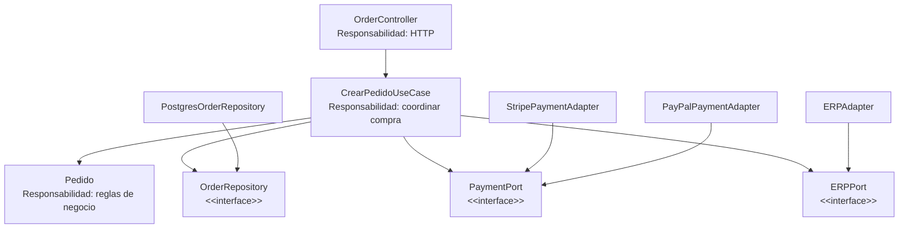

# Principios de diseño (SOLID)

> **Proyecto:** Marketplace de productos para mascotas  
> **Backend:** Node.js + Express / TypeScript  
> **Estilo arquitectónico:** Monolito modular  
> **Enfoque interno:** Clean Architecture  
> **Módulo de referencia:** Pedidos

---

## 1. Objetivo

Documentar cómo se aplican los principios **SOLID** en el backend del Marketplace, organizado mediante Clean Architecture.

El propósito es que los módulos puedan desarrollarse de manera uniforme, manteniendo separadas las reglas del negocio de los detalles tecnológicos como:

- Express.
- PostgreSQL.
- Stripe.
- PayPal.
- ERP.
- Servicios externos.

Los principios SOLID contribuyen principalmente a mejorar la:

- Mantenibilidad.
- Extensibilidad.
- Testabilidad.
- Modularidad.
- Separación de responsabilidades.

---

# 2. Contexto

El Marketplace utiliza:

- **Estilo:** monolito modular.
- **Backend:** Node.js + Express.
- **Enfoque interno:** Clean Architecture.
- **Capas:** presentación, aplicación, dominio e infraestructura.
- **Módulo de referencia:** Pedidos.

El módulo Pedidos resulta apropiado para analizar SOLID porque participa en diferentes responsabilidades e integraciones:

```text
Cliente
   │
   ▼
OrderController
   │
   ▼
CrearPedidoUseCase
   │
   ├────────► Pedido
   │
   ├────────► OrderRepository
   │
   ├────────► PaymentPort
   │
   └────────► ERPPort
```

Las implementaciones concretas se encuentran en infraestructura:

```text
OrderRepository
      ▲
      │
PostgresOrderRepository

PaymentPort
      ▲
      ├── StripePaymentAdapter
      └── PayPalPaymentAdapter

ERPPort
      ▲
      │
ERPAdapter
```

---

# 3. Principios SOLID

SOLID está compuesto por cinco principios:

| Letra | Principio |
|---|---|
| **S** | Single Responsibility Principle |
| **O** | Open/Closed Principle |
| **L** | Liskov Substitution Principle |
| **I** | Interface Segregation Principle |
| **D** | Dependency Inversion Principle |

---

# 4. Resumen de aplicación en el Marketplace

| Principio | Dónde se aplica | Cómo se cumple |
|---|---|---|
| **S - Responsabilidad única** | Todas las capas | Cada clase tiene una responsabilidad específica. |
| **O - Abierto/Cerrado** | Infraestructura | Es posible incorporar nuevos proveedores mediante nuevos adaptadores sin modificar los casos de uso. |
| **L - Sustitución de Liskov** | Infraestructura | Diferentes implementaciones de una interfaz pueden sustituirse manteniendo el mismo contrato. |
| **I - Segregación de interfaces** | Dominio | Se utilizan interfaces pequeñas y específicas para cada necesidad. |
| **D - Inversión de dependencias** | Aplicación / Dominio | Los casos de uso dependen de abstracciones y no de tecnologías concretas. |

---

# 5. S — Principio de Responsabilidad Única

## Single Responsibility Principle — SRP

> Una clase debe tener una única responsabilidad principal y una única razón importante para cambiar.

En el módulo Pedidos, cada elemento tiene una responsabilidad claramente definida.

```text
OrderController
      │
      │ Recibe solicitudes HTTP
      ▼
CrearPedidoUseCase
      │
      │ Coordina el proceso de compra
      ▼
Pedido
      │
      │ Aplica reglas del negocio
      ▼
OrderRepository
      │
      │ Define persistencia
      ▼
PostgresOrderRepository
         Guarda información en PostgreSQL
```

---

## 5.1. Responsabilidades

| Clase | Responsabilidad |
|---|---|
| `OrderController` | Recibir y responder solicitudes HTTP. |
| `CrearPedidoUseCase` | Coordinar el proceso necesario para crear un pedido. |
| `Pedido` | Aplicar reglas propias del pedido. |
| `PostgresOrderRepository` | Persistir pedidos utilizando PostgreSQL. |
| `StripePaymentAdapter` | Comunicarse con Stripe. |
| `ERPAdapter` | Comunicarse con el ERP. |

---

## 5.2. Ejemplo

El controlador debe limitarse principalmente a:

```typescript
export class OrderController {

    constructor(
        private readonly crearPedido:
            CrearPedidoUseCase
    ) {}

    crear = async (
        req: Request,
        res: Response
    ): Promise<void> => {

        const pedidoId =
            await this.crearPedido.ejecutar({
                clienteId: req.user.id,
                items: req.body.items,
                tokenPago: req.body.tokenPago
            });

        res.status(201).json({
            pedidoId
        });
    };
}
```

El controlador:

```text
✓ recibe HTTP
✓ obtiene los datos
✓ ejecuta el caso de uso
✓ devuelve HTTP
```

No debería:

```text
✗ calcular directamente el total
✗ ejecutar SQL
✗ llamar directamente a Stripe
✗ aplicar reglas del pedido
```

---

# 6. O — Principio Abierto/Cerrado

## Open/Closed Principle — OCP

> Los componentes deben estar abiertos a extensión, pero cerrados a modificaciones innecesarias.

Un ejemplo claro en el Marketplace es la integración con la pasarela de pago.

El dominio define:

```typescript
export interface PaymentPort {

    cobrar(
        monto: number,
        token: string
    ): Promise<ResultadoCobro>;

}
```

Inicialmente puede existir:

```text
PaymentPort
     ▲
     │
StripePaymentAdapter
```

Posteriormente puede agregarse:

```text
PaymentPort
     ▲
     ├── StripePaymentAdapter
     │
     └── PayPalPaymentAdapter
```

No es necesario modificar:

```text
Pedido
CrearPedidoUseCase
OrderController
```

Solamente se agrega una nueva implementación.

---

## 6.1. Ejemplo

```typescript
export class PayPalPaymentAdapter
    implements PaymentPort {

    async cobrar(
        monto: number,
        token: string
    ): Promise<ResultadoCobro> {

        // Implementación específica de PayPal.

        return {
            aprobado: true,
            autorizacion: "PAYPAL-AUTH-001"
        };
    }
}
```

El caso de uso sigue trabajando con:

```typescript
private readonly paymentPort: PaymentPort
```

y no necesita conocer qué proveedor se está utilizando.

---

# 7. L — Principio de Sustitución de Liskov

## Liskov Substitution Principle — LSP

> Una implementación debe poder sustituir a otra que cumpla el mismo contrato sin alterar el funcionamiento esperado del sistema.

En el Marketplace:

```text
PaymentPort
       ▲
       │
 ┌─────┴─────┐
 │           │
Stripe     PayPal
```

Ambos adaptadores deben respetar:

```typescript
cobrar(
    monto: number,
    token: string
): Promise<ResultadoCobro>
```

y devolver una estructura compatible:

```typescript
{
    aprobado: boolean,
    autorizacion: string
}
```

---

## 7.1. Aplicación

El caso de uso puede recibir:

```typescript
new StripePaymentAdapter()
```

o:

```typescript
new PayPalPaymentAdapter()
```

sin modificar su lógica:

```typescript
const resultado =
    await this.paymentPort.cobrar(
        monto,
        tokenPago
    );
```

Esto permite sustituir implementaciones manteniendo el comportamiento esperado.

---

# 8. I — Principio de Segregación de Interfaces

## Interface Segregation Principle — ISP

> Un componente no debería depender de operaciones que no necesita.

Las interfaces del dominio deben ser pequeñas y específicas.

Por ejemplo, `PaymentPort` solamente contiene operaciones relacionadas con pagos:

```typescript
export interface PaymentPort {

    cobrar(
        monto: number,
        token: string
    ): Promise<ResultadoCobro>;

}
```

Para el ERP puede existir:

```typescript
export interface ERPPort {

    registrarPedido(
        pedido: Pedido
    ): Promise<void>;

}
```

Y para persistencia:

```typescript
export interface OrderRepository {

    guardar(
        pedido: Pedido
    ): Promise<void>;

    buscarPorId(
        id: string
    ): Promise<Pedido | null>;

}
```

---

## 8.1. Lo que se evita

No sería recomendable crear una interfaz general como:

```typescript
interface MarketplaceService {

    cobrar(): void;

    guardarPedido(): void;

    registrarERP(): void;

    enviarNotificacion(): void;

    calcularEnvio(): void;

    actualizarProducto(): void;
}
```

porque una implementación probablemente no necesite todas esas operaciones.

Es preferible:

```text
PaymentPort
ERPPort
OrderRepository
ShippingPort
NotificationPort
```

Cada interfaz representa una capacidad específica.

---

# 9. D — Principio de Inversión de Dependencias

## Dependency Inversion Principle — DIP

> Los componentes de alto nivel deben depender de abstracciones y no de implementaciones concretas.

Este principio es especialmente importante en Clean Architecture.

El caso de uso:

```text
CrearPedidoUseCase
```

no debería depender directamente de:

```text
PostgresOrderRepository
StripePaymentAdapter
ERPAdapter
```

En cambio depende de:

```text
OrderRepository
PaymentPort
ERPPort
```

---

## 9.1. Diseño correcto

```text
               CrearPedidoUseCase
                  /     |      \
                 /      |       \
                ▼       ▼        ▼
      OrderRepository PaymentPort ERPPort
             ▲            ▲        ▲
             │            │        │
        PostgreSQL      Stripe     ERPAdapter
                        PayPal
```

Las dependencias apuntan hacia abstracciones.

---

## 9.2. Constructor del caso de uso

```typescript
export class CrearPedidoUseCase {

    constructor(

        private readonly orderRepository:
            OrderRepository,

        private readonly paymentPort:
            PaymentPort,

        private readonly erpPort:
            ERPPort

    ) {}

}
```

El caso de uso desconoce las implementaciones concretas.

---

# 10. Inyección de dependencias

Las implementaciones concretas se seleccionan en la raíz de composición del módulo.

Por ejemplo:

```typescript
export function crearModuloPedidos(
    db: Pool,
    stripe: Stripe
) {

    const repository =
        new PostgresOrderRepository(db);

    const payment =
        new StripePaymentAdapter(stripe);

    const erp =
        new ERPAdapter();

    const crearPedido =
        new CrearPedidoUseCase(
            repository,
            payment,
            erp
        );

    return {
        controller:
            new OrderController(
                crearPedido
            )
    };
}
```

De esta manera:

```text
Aplicación
     ↓
Interfaces

Infraestructura
     ↓
Implementaciones
```

y la composición conecta ambas partes.

---

# 11. Diagrama SOLID del módulo Pedidos



Este diseño resume la aplicación de SOLID:

```text
SRP
Cada elemento posee una responsabilidad.

OCP
Pueden agregarse implementaciones sin modificar los casos de uso.

LSP
Stripe y PayPal pueden sustituirse respetando PaymentPort.

ISP
Existen interfaces pequeñas y especializadas.

DIP
CrearPedidoUseCase depende de interfaces.
```

---

# 12. Qué pasaría sin SOLID

| Situación | Sin SOLID | Con SOLID |
|---|---|---|
| Cambiar Stripe por otra pasarela | Se modifica el caso de uso de compra. | Se crea o sustituye un adaptador. |
| Cambiar el ERP | Se modifica la lógica del módulo Pedidos. | Se reemplaza la implementación de `ERPPort`. |
| Cambiar PostgreSQL | Los casos de uso contienen SQL y deben modificarse. | Se implementa otro `OrderRepository`. |
| Probar la creación de pedidos | Se necesita PostgreSQL y Stripe reales. | Se utilizan implementaciones simuladas o en memoria. |
| Cambiar una regla del pedido | Puede estar dispersa entre controladores y servicios. | Se encuentra centralizada en la entidad `Pedido`. |
| Agregar PayPal | Debe modificarse el flujo de compra. | Se agrega `PayPalPaymentAdapter`. |

---

# 13. Aplicación en pruebas

La inversión de dependencias permite reemplazar infraestructura real durante las pruebas.

Por ejemplo:

```typescript
export class InMemoryOrderRepository
    implements OrderRepository {

    private pedidos: Pedido[] = [];

    async guardar(
        pedido: Pedido
    ): Promise<void> {

        this.pedidos.push(pedido);
    }

    async buscarPorId(
        id: string
    ): Promise<Pedido | null> {

        return this.pedidos.find(
            pedido => pedido.id === id
        ) ?? null;
    }
}
```

También puede utilizarse una implementación simulada para pagos:

```typescript
export class FakePaymentAdapter
    implements PaymentPort {

    async cobrar():
        Promise<ResultadoCobro> {

        return {
            aprobado: true,
            autorizacion: "TEST-001"
        };
    }
}
```

Así se puede probar:

```text
CrearPedidoUseCase
```

sin utilizar:

```text
Stripe real
PostgreSQL real
ERP real
```

---

# 14. Relación entre SOLID y Clean Architecture

SOLID y Clean Architecture se complementan.

| Principio | Aplicación en el proyecto |
|---|---|
| Responsabilidad única | Separación entre presentación, aplicación, dominio e infraestructura. |
| Abierto/Cerrado | Nuevos adaptadores pueden agregarse sin modificar los casos de uso. |
| Sustitución de Liskov | Las implementaciones respetan los contratos definidos por las interfaces. |
| Segregación de interfaces | Puertos especializados como `PaymentPort`, `ERPPort` y `OrderRepository`. |
| Inversión de dependencias | Las capas externas dependen de abstracciones definidas hacia el interior. |

La regla general puede representarse así:

```text
Frameworks / Infraestructura
           │
           ▼
       Interfaces
           │
           ▼
        Dominio
```

Las reglas principales del negocio permanecen independientes de la tecnología.

---

# 15. Relación con los patrones de diseño

Los principios SOLID se apoyan en los patrones documentados anteriormente.

| Principio | Patrón relacionado |
|---|---|
| SRP | Separación de responsabilidades mediante capas. |
| OCP | Adapter |
| LSP | Adapter |
| ISP | Puertos e interfaces específicas |
| DIP | Repository + Adapter + Inyección de dependencias |

Ejemplo:

```text
PaymentPort
     ▲
     │
StripePaymentAdapter
```

combina:

```text
Adapter
+
OCP
+
LSP
+
DIP
```

---

# 16. Relación con mantenibilidad

Los principios SOLID permiten responder directamente al atributo de calidad de **mantenibilidad** definido previamente para el Marketplace.

Se busca que:

- Los cambios se concentren en el módulo responsable.
- Las dependencias sean explícitas.
- Las implementaciones puedan sustituirse.
- Las reglas del negocio permanezcan aisladas.
- Los cambios tecnológicos no afecten innecesariamente a otras funcionalidades.

Esto permite que una modificación tenga un impacto más localizado dentro del sistema.

---

# 17. Resumen

| Código | Principio | Aplicación principal |
|---|---|---|
| S | Responsabilidad única | Una responsabilidad principal por clase. |
| O | Abierto/Cerrado | Nuevas implementaciones mediante adaptadores. |
| L | Sustitución de Liskov | Stripe y PayPal respetan `PaymentPort`. |
| I | Segregación de interfaces | Interfaces pequeñas y específicas. |
| D | Inversión de dependencias | Casos de uso dependen de abstracciones. |

---

# 18. Conclusión

Los principios SOLID permiten mantener la estructura interna del Marketplace alineada con Clean Architecture.

En el módulo Pedidos:

- El controlador se responsabiliza de HTTP.
- El caso de uso coordina el proceso de compra.
- La entidad `Pedido` contiene las reglas del negocio.
- Los repositorios abstraen la persistencia.
- Los puertos abstraen servicios externos.
- Los adaptadores implementan las integraciones concretas.
- La raíz de composición conecta las dependencias.

De esta manera, el negocio permanece desacoplado de PostgreSQL, Stripe, PayPal y el ERP, facilitando el mantenimiento, las pruebas y la evolución futura del sistema.